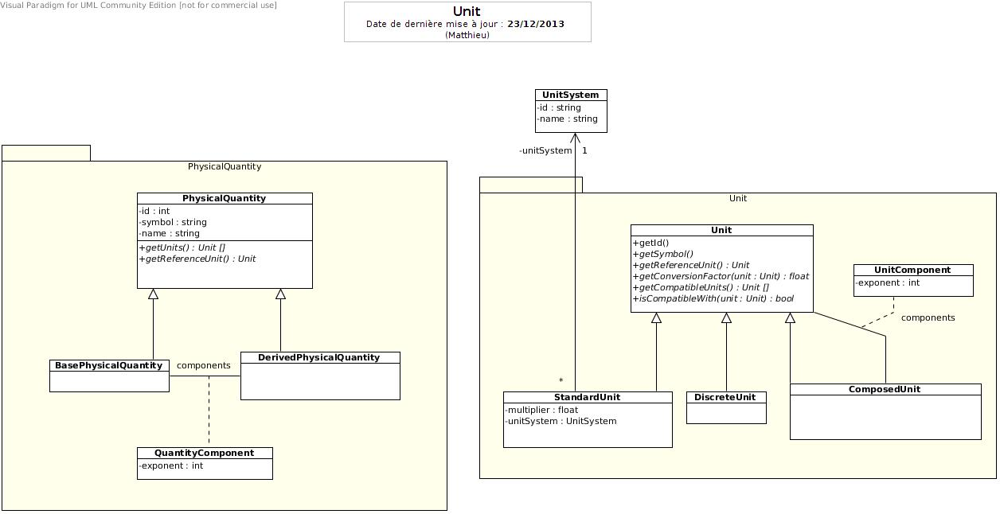

# Units



## Getting started

The PHP `intl` extension is required, it can be installed easily on debian systems with `apt-get install php5-intl`.

```bash
$ composer install
$ app/console doctrine:database:create
$ app/console doctrine:schema:create
$ app/console unit:populate
```

## Running the tests

Running the unit tests:

```bash
$ phpunit
```

Running the functional tests:

```bash
$ app/console doctrine:schema:drop --force --env=test
$ app/console doctrine:schema:create --env=test
$ app/console unit:populate --env=test
$ phpunit -c phpunit-functional.xml.dist
```

The functional test suite automatically generates a SQLite database in the `tests/FunctionalTest` directory.
As such, it requires the `pdo_sqlite` extension and the user running the
tests must have write permissions in that directory.

Continuous integration is done on CircleCI: https://circleci.com/gh/myclabs/Units

## Running the server

```bash
$ app/console server:run
```

The server is now running at [http://localhost:8000/](http://localhost:8000/).

If you are using Vagrant, run:

```bash
$ app/console server:run 0.0.0.0:8000
```

## Deploying

Deployment is done use Capifony. Execute these commands on your local machine.

```bash
$ cap deploy # by default, in development
$ cap development deploy
$ cap testing deploy
$ cap production deploy
```

The first time, the server needs to be set up:

```bash
$ cap production deploy:setup
```

## Troubleshooting

Some server files could belong to the last deploying user, if necessary run the following command on the server:

```bash
$ chown -R root:deployers /home/web/units/shared/cached-copy
```

Capistrano may have some problem with authentication using interactive method. Uninstalling the net-ssh gem and reinstalling the 2.7.0 version solve this problem:

```bash
$ gem uninstall net-ssh
$ gem install net-ssh -v 2.7.0
```
