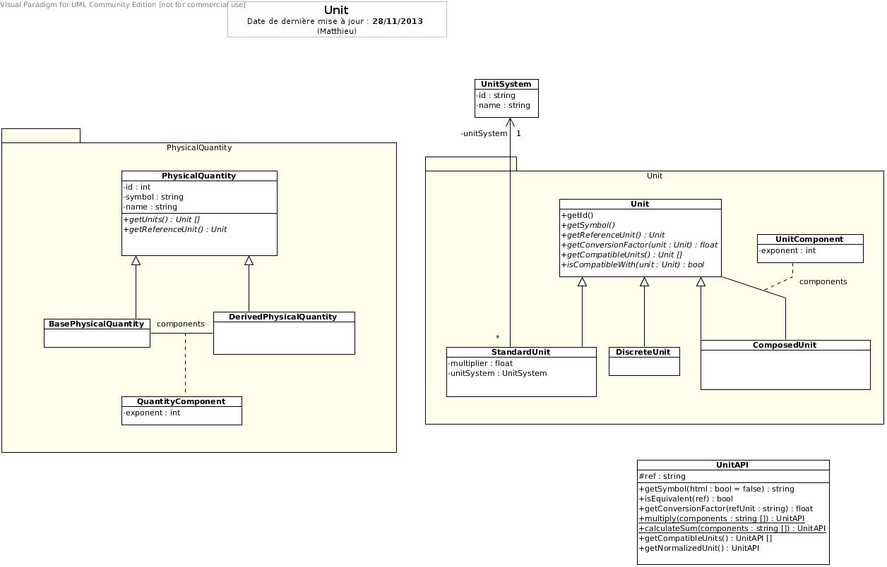

# Units



## Getting started

The PHP `intl` extension is required, it can be installed easily on debian systems with `apt-get install php5-intl`.

```shell
$ composer install
$ app/console doctrine:database:create
$ app/console doctrine:schema:create
$ app/console unit:populate
```

## Running the tests

Running the unit tests:

```shell
$ phpunit
```

Running the functional tests:

```shell
$ app/console doctrine:schema:drop --force --env=test
$ app/console doctrine:schema:create --env=test
$ app/console unit:populate --env=test
$ phpunit -c phpunit-functional.xml.dist
```

The functional test suite automatically generates a SQLite database in the `tests/FunctionalTest` directory.
As such, it requires the `pdo_sqlite` extension and the user running the
tests must have write permissions in that directory.

## Running the server

```shell
$ app/console server:run
```

The server is now running at [http://localhost:8000/](http://localhost:8000/).

## Deploying

Deployment is done use Capifony.

```shell
$ cap deploy # by default, in development
$ cap development deploy
$ cap testing deploy
$ cap production deploy
```
